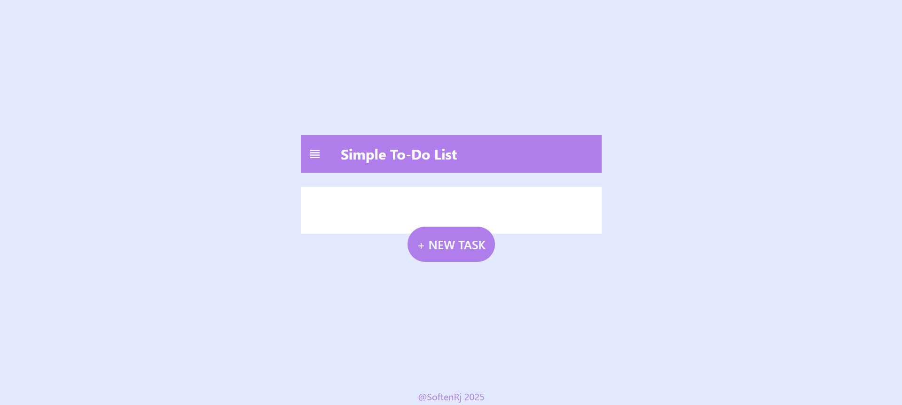
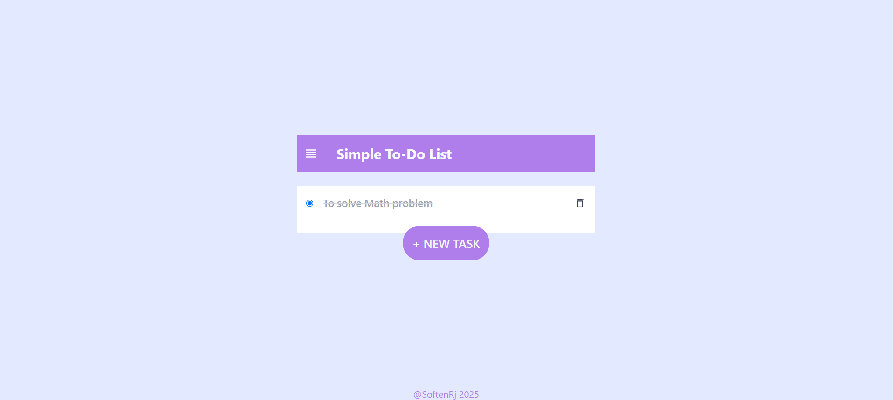
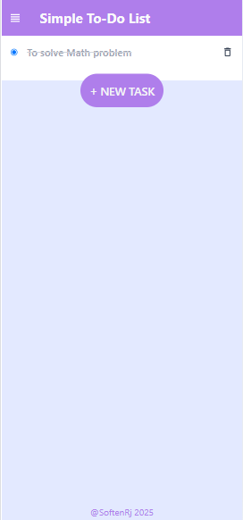

# 📝 Simple To-Do List App (React + Tailwind)

A modern and minimal **To-Do List** built with **React.js** and **Tailwind CSS**. This app allows users to **add, mark, and delete** tasks with a clean and intuitive UI.

## 🚀 Features

✅ **Add New Tasks** – Write and save tasks in a stylish text area.  
✅ **Mark as Completed** – Tasks can be marked as done with a strike-through effect.  
✅ **Delete Tasks** – Remove completed tasks easily.  
✅ **Local Storage** – Tasks persist even after refreshing the page.  
✅ **Responsive Design** – Works seamlessly on mobile and desktop. 

## 📜 ScreenShort
- **Desktop view**
   
   
- **Mobile view**
   
## 🛠️ Tech Stack

- **React.js** – Component-based UI  
- **Tailwind CSS** – For modern styling  
- **Material UI Icons** – For an enhanced UI  
- **Local Storage** – To store tasks  


## 💪 Installation

### 1️⃣ Clone the repository  
```sh
git clone https://github.com/your-username/todo-app.git
```

### 2️⃣ Navigate to the project folder  
```sh
cd todo-app
```

### 3️⃣ Install dependencies  
```sh
npm install
```

### 4️⃣ Run the app  
```sh
npm start
```


## 🔧 Usage

1. **Add a Task**  
   - Click the **+ NEW TASK** button to open the text area.  
   - Enter your task and press **Enter** to add it.  

2. **Mark as Completed**  
   - Click the radio button next to a task to **mark it as done**.  
   - Completed tasks will have a **strike-through effect**.  

3. **Delete a Task**  
   - Click the **delete icon** (🛢️) next to a completed task to remove it.  

## 🛠️ Future Enhancements

🚀 **Dark Mode** – Implement a toggle switch for dark mode.  
🗓 **Due Dates** – Add a feature to set due dates for tasks.  
📱 **Drag & Drop** – Reorder tasks using drag-and-drop.  
🔔 **Notifications** – Remind users of pending tasks.  

## 🐝 Contributing

Contributions are always welcome! Feel free to open an issue or submit a pull request.

---

💡 **Want to contribute?** Feel free to submit a pull request! 🚀
